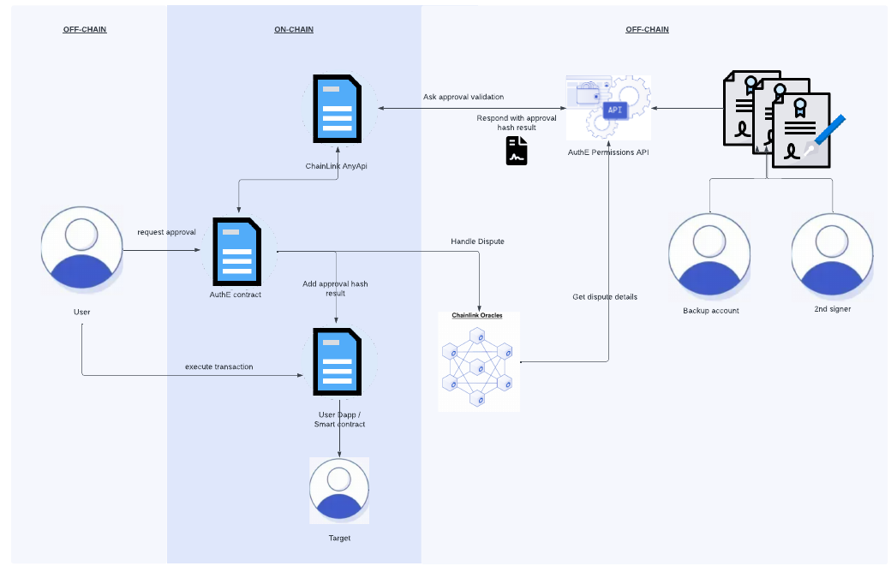

# Project created as part of the Chainlink Hackathon 2023 - AuthE

Website: https://authe.io/

## Hackathon project page:
https://devpost.com/software/authe

## What it does
It proposes a way to validate transactions off-chain based on pre-signed permission documents. Its a 2-step process where the user first requests approval and then when the approval is given it can execute the transaction. The permission documents contain instructions in a programmatic way to validate the transactions so that we can recalculate and automate the approval process. Currently users missclick/send funds to the wrong address/get phished/get hacked and this will only get worse with Ethereum Account Abstraction where with 1 click of the button you can send multiple transactions. Having a system with fine grained access control can save your funds.


## How we built it
Its using AWS, Python, Javascript, React

## Architecture:


## Modification on ERC20 standard
#### Just a few lines of code to change it. Some of it can even be optimized
#### The casting of the bytes32 was just a hack to get it working
```javascript

    mapping(address => mapping (string => bool)) approved_transactions;   
    mapping(address => bool) opt_in_for_auth_proxy;   
    mapping(address => address) auth_provider;   
    
    modifier hasUseAuthProxySetAndIsApproved {
            if (opt_in_for_auth_proxy[msg.sender] == true){
                bytes32 hash_result = keccak256(abi.encode(msg.sender, address(this), convertCallDataToString(msg.data)));
                // Cast the hash to string
                string memory hash_result_string = convertHashToString(hash_result);
                require(approved_transactions[msg.sender][hash_result_string] == true, "Transaction has not been approved");
            }
        _;
    }
```